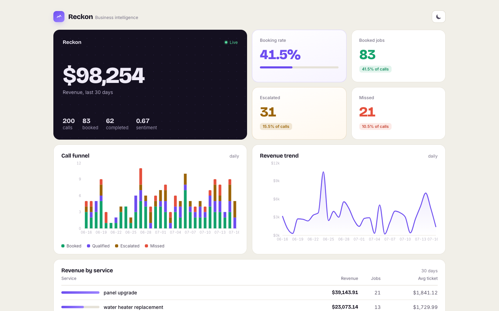
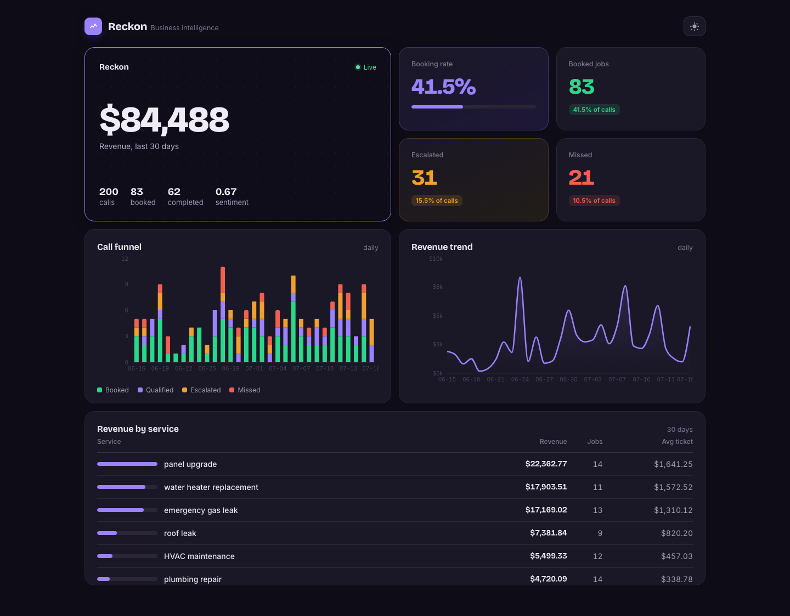
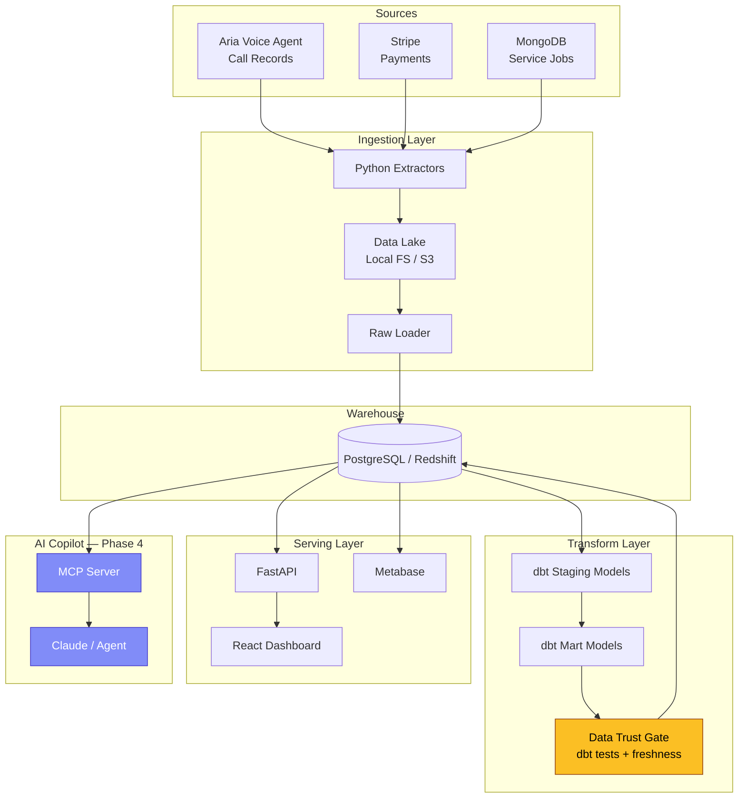

# Reckon

**A business-intelligence platform with an AI copilot** — by [AIntellect](https://github.com/AIntellect).

Reckon ingests a business's scattered operational data, pipelines it into a warehouse, surfaces dashboards, and lets a non-technical owner ask questions in plain English. Data flows in from three sources: **Aria** (AI voice agent call records), **Stripe** (payment transactions), and **MongoDB** (service job records). Metabase provides self-serve BI alongside the custom React dashboard.

---

## Dashboard

<p align="center">
  
</p>
<p align="center">
  
</p>

---

## Architecture



### AWS Cloud Architecture (Phase 2)

```mermaid
graph TB
    subgraph "AWS Cloud"
        subgraph "EKS Cluster (2 nodes)"
            API[API Deployment<br/>2 replicas]
            DASH[Dashboard Deployment<br/>2 replicas]
            PIPE[Pipeline CronJob<br/>every 6h]
        end

        subgraph "Data Stores"
            S3[S3 Data Lake<br/>versioned + encrypted]
            RS[Redshift Serverless<br/>8 RPU base]
        end

        subgraph "Container Registry"
            ECR[ECR<br/>3 repositories]
        end

        LB1[Load Balancer] --> API
        LB2[Load Balancer] --> DASH
        API --> RS
        PIPE --> S3
        PIPE --> RS
        ECR -.-> API
        ECR -.-> DASH
        ECR -.-> PIPE
    end

    subgraph "IaC"
        TF[Terraform]
        HELM[Helm Chart]
    end

    TF --> S3
    TF --> RS
    TF --> EKS Cluster
    TF --> ECR
    HELM --> API
    HELM --> DASH
    HELM --> PIPE

    style TF fill:#7c3aed,stroke:#5b21b6,color:#fff
    style HELM fill:#0ea5e9,stroke:#0284c7,color:#fff
```

## Project Structure

```
Reckon/
├── ingest/                  # Python extractors and data-lake writers
│   ├── extractors/          # Per-source extractors (Aria, Stripe, MongoDB)
│   ├── tests/               # Extractor unit tests
│   ├── config.py            # Config loader (env-var driven)
│   ├── lake.py              # Data-lake abstraction (local / S3)
│   ├── loader.py            # Raw-to-warehouse loader
│   └── pipeline.py          # Pipeline entrypoint
├── transform/               # dbt project
│   ├── models/staging/      # Cleaned, typed views
│   ├── models/marts/        # Business-logic tables
│   ├── dbt_project.yml
│   └── profiles.yml         # Config-driven (Postgres / Redshift)
├── warehouse/init/          # DDL scripts for schema init
├── api/                     # FastAPI serving layer
├── dashboard/               # React + Recharts dashboard
│   └── src/components/      # KPI cards, funnel chart, revenue chart
├── mongo/init/              # MongoDB seed data and init script
├── metabase/                # Metabase setup script
├── copilot/                 # MCP copilot server (AI Q&A over warehouse)
│   ├── tests/               # Trust gate, security, and tool correctness tests
├── infra/
│   ├── terraform/           # AWS infrastructure (VPC, EKS, Redshift, S3, ECR, IAM)
│   ├── helm/reckon/         # Helm chart (API, dashboard, pipeline CronJob)
│   └── docker/              # Dockerfiles
├── scripts/                 # Pipeline and ECR push scripts
├── observability/           # Prometheus, Grafana, Loki (Phase 3)
├── .github/workflows/       # CI/CD (GitHub Actions)
├── docker-compose.yml       # One-command local dev
├── Makefile                 # make up / make down / make deploy
└── .env.example             # Environment template
```

## Quick Start

### Prerequisites
- Docker and Docker Compose

### Run It

```bash
# 1. Clone and configure
git clone <repo-url> && cd Reckon
cp .env.example .env

# 2. Start everything
docker-compose up --build

# 3. What happens:
#    - PostgreSQL warehouse starts
#    - Pipeline runs: extracts sample data, loads to warehouse, runs dbt
#    - API starts on http://localhost:8000
#    - Dashboard starts on http://localhost:5173
```

### Verify

| Service     | URL                          | What to check                     |
|-------------|------------------------------|-----------------------------------|
| API health  | http://localhost:8000/health  | `{"status": "ok"}`               |
| Call funnel | http://localhost:8000/api/call-funnel | Daily funnel data with job counts |
| Revenue     | http://localhost:8000/api/revenue     | Daily revenue data        |
| Jobs        | http://localhost:8000/api/jobs/summary | Completion rate, value    |
| Dashboard   | http://localhost:5173         | Interactive charts and KPIs      |
| Metabase    | http://localhost:3001         | Self-serve BI (run `bash metabase/setup.sh` first) |

### Run Tests Locally

```bash
# Extractor unit tests
pip install psycopg2-binary boto3 pytest
pytest ingest/tests/ -v

# dbt tests (requires warehouse running)
cd transform
pip install dbt-core dbt-postgres
dbt deps --profiles-dir .
dbt test --profiles-dir .
```

## Deploy to AWS

> **COST WARNING**: EKS (~$0.10/hr for the control plane + ~$0.08/hr for 2x t3.medium nodes),
> Redshift Serverless (~$0.36/RPU-hr, 8 RPU minimum when active), NAT Gateway (~$0.045/hr),
> and Load Balancers (~$0.025/hr each) all cost money while running. **Stand it up, verify,
> screenshot, tear it down.** A full stack running for 1 hour costs roughly $3-5. `make down`
> destroys everything completely.

### Prerequisites
- AWS CLI configured (`aws configure`)
- Terraform >= 1.5
- Docker
- kubectl
- Helm 3

### Deploy

```bash
# 1. Configure Terraform variables
cp infra/terraform/terraform.tfvars.example infra/terraform/terraform.tfvars
# Edit terraform.tfvars: set redshift_admin_password

# 2. Set Redshift credentials for Helm
export REDSHIFT_USER=reckon_admin
export REDSHIFT_PASSWORD=your_password_here

# 3. Deploy everything (Terraform + ECR push + Helm install)
make up

# 4. Trigger the first pipeline run
make pipeline-run

# 5. Check status
make status
```

The `make up` command:
1. Runs `terraform init` and `terraform apply` (VPC, EKS, Redshift, S3, ECR, IAM)
2. Builds all 3 Docker images and pushes to ECR
3. Updates kubeconfig for the new EKS cluster
4. Helm-installs the chart with all Terraform outputs wired in
5. Prints the LoadBalancer URLs for API and dashboard

### Access

| Service   | URL |
|-----------|-----|
| Dashboard | `kubectl get svc -n reckon reckon-reckon-dashboard -o jsonpath='{.status.loadBalancer.ingress[0].hostname}'` |
| API       | `kubectl get svc -n reckon reckon-reckon-api -o jsonpath='{.status.loadBalancer.ingress[0].hostname}'` |

### Redeploy (code changes only)

```bash
make deploy   # Rebuilds images, pushes to ECR, rolls out new pods
```

### Teardown

```bash
make down     # Helm uninstall + terraform destroy. Zero resources remain.
```

This deletes the EKS cluster, Redshift namespace, S3 bucket (force-emptied), ECR repos (force-deleted),
VPC, NAT gateway, load balancers, and all IAM roles. Nothing is left running or billing.

### Local Dev (unchanged from Phase 1)

```bash
docker compose up --build   # or: make local
```

---

## AI Copilot

The copilot lets a non-technical owner ask plain-English questions and get answers grounded in the warehouse marts. Every answer is auditable: the tool called, the SQL query, and the rows returned are shown alongside the response.

### Quick Start

```bash
# Install copilot deps
pip install -r copilot/requirements.txt

# Set your API key
export ANTHROPIC_API_KEY=sk-ant-...

# With docker compose running:
python -m copilot.cli
```

### Example Session

```
You: What's my booking rate?

  Tool: call_funnel
  Input: {}
  SQL: SELECT sum(total_calls) AS total_calls, sum(booked) AS booked, ...
       FROM marts.mart_call_funnel
  Rows: 1

Answer:
Your overall booking rate is 42.0%. Out of 200 total calls, 84 resulted
in a booking.
```

### Stale Data Refusal

When the pipeline has not run recently (>48 hours), the copilot refuses to answer rather than give stale numbers:

```
You: How much revenue last week?

  Tool: revenue_summary
  Input: {"date_from": "2026-07-07", "date_to": "2026-07-13"}
  Error: Cannot answer: aria_calls data is stale (52h old, threshold is
         48h). Please run the pipeline before querying.

Answer:
I can't answer that right now. The data is stale -- aria_calls was last
loaded 52 hours ago, which is past the 48-hour threshold. Please run the
pipeline first to refresh the data.
```

### Out-of-Scope Refusal

When asked something the marts cannot answer, the copilot says so honestly:

```
You: Who is my biggest customer by name?

Answer:
I can't answer that from the data I have. The marts tables track revenue
by service type and payment method, but they don't include customer names
or individual customer-level breakdowns.
```

### Claude Desktop Integration

Add this to your `claude_desktop_config.json`:

```json
{
  "mcpServers": {
    "reckon": {
      "command": "python",
      "args": ["-m", "copilot.server"],
      "cwd": "/path/to/Reckon",
      "env": {
        "POSTGRES_HOST": "localhost",
        "POSTGRES_PORT": "5432",
        "POSTGRES_DB": "reckon",
        "POSTGRES_USER": "reckon",
        "POSTGRES_PASSWORD": "reckon_dev",
        "COPILOT_DB_USER": "reckon_reader",
        "COPILOT_DB_PASSWORD": "reckon_reader_dev"
      }
    }
  }
}
```

### Security Model

Safety lives in the tools and the database role, not in the prompt:

1. **DB role enforcement** (load-bearing): the `reckon_reader` Postgres role has `SELECT` on the `marts` schema only. No access to `raw`, `staging`, or system catalogs. Even if the SQL validator misses something, the database blocks it.
2. **SQL validator** (defense in depth): rejects DDL, DML, multi-statement input, and references to non-allowlisted tables before the query reaches the database.
3. **Read-only session**: the connection is set to `READ ONLY` mode, so writes fail even if the role somehow allowed them.
4. **Row cap and timeout**: maximum 100 rows per query, 5-second timeout.
5. **Audit log**: every tool call, query, and refusal is logged as structured JSON to stderr.

### Run Copilot Tests

```bash
# All tests (requires docker compose up)
pytest copilot/tests/ -v

# Unit tests only (no DB required)
pytest copilot/tests/test_trust_gate.py::TestSqlValidation \
       copilot/tests/test_trust_gate.py::TestRowCap \
       copilot/tests/test_tools.py::TestDescribeSchema \
       copilot/tests/test_security.py::TestSqlInjection -v
```

---

## Data Pipeline

1. **Extract** — Python extractors pull data from three sources: Aria call records, Stripe payments, and MongoDB service jobs
2. **Land** — Raw JSON written to data lake (local filesystem, swappable to S3). Lake writes are idempotent (prior extracts cleared before new writes)
3. **Load** — Raw data loaded into `raw` schema in the warehouse
4. **Transform** — dbt staging models clean and type the data; mart models aggregate into business metrics (call funnel, revenue, job completion)
5. **Trust Gate** — dbt tests validate uniqueness, not-null, accepted values; source freshness checks ensure data is current across all three sources
6. **Serve** — FastAPI reads from marts; React dashboard and Metabase visualize the data

## Data Trust Gate

Every model has dbt tests that enforce:
- **Uniqueness**: no duplicate `call_id` or `payment_id`
- **Not-null**: critical fields are always present
- **Accepted values**: `urgency`, `outcome`, and `status` are constrained to known values
- **Source freshness**: data older than 24h triggers a warning; older than 48h fails the pipeline

The pipeline uses `dbt build`, which runs tests inline — a failing test stops downstream models from materializing.

## Roadmap

### Phase 1 — Foundation
- [x] Monorepo scaffold
- [x] Two Python extractors with sample data
- [x] Data-lake abstraction (local / S3)
- [x] dbt staging + marts with tests and freshness
- [x] FastAPI serving layer
- [x] React dashboard (call funnel + revenue)
- [x] GitHub Actions CI
- [x] Docker Compose for local dev

### Phase 2 — Cloud and Kubernetes (current)
- [x] Terraform IaC: VPC, EKS cluster, Redshift Serverless, S3 data lake, ECR, IAM
- [x] Helm chart: API and dashboard Deployments, pipeline CronJob, K8s Secrets
- [x] ECR build-and-push scripts for all 3 images
- [x] Config-driven cloud swap (env vars + K8s Secrets, zero app code changes)
- [x] Makefile lifecycle: `make up` (full deploy), `make down` (full teardown), `make deploy` (redeploy)
- [x] dbt multi-target profiles (dev=Postgres, prod=Redshift)
- [x] Security groups scoped: EKS nodes <-> Redshift only

### Phase 3 — Observability and BI
- [x] MongoDB as a third data source (service jobs)
- [x] Metabase for self-serve BI (auto-provisioned warehouse connection)
- [x] Idempotent lake writes and deterministic seed data
- [ ] OpenTelemetry instrumentation across Python services
- [ ] Prometheus metrics collection
- [ ] Grafana dashboards for pipeline health
- [ ] Loki for centralized logging
- [ ] Alerting (PagerDuty / Slack integration)

### Phase 4 — AI Copilot (current)
- [x] MCP server (6 tools: revenue, call funnel, jobs, freshness, schema, guarded SQL)
- [x] Read-only SQL guardrails (query validation, row cap, statement timeout, allowlisted tables)
- [x] Read-only DB role (`reckon_reader`): SELECT on marts only, no raw or staging access
- [x] Trust-gate enforcement: stale data (>48h) produces a refusal, not a guess; warn (24-48h) adds a caveat
- [x] Freshness gate based on pipeline load time (`_loaded_at`), not event timestamps
- [x] CLI REPL demo: grounded answers with the query and rows shown alongside every answer
- [x] Claude Desktop integration documented
- [x] 57 tests: security (injection, privilege escalation), trust gate (freshness, SQL validation), tool correctness
- [ ] Conversation memory and follow-up queries

## Tech Stack

| Layer         | Technology                              |
|---------------|-----------------------------------------|
| Ingestion     | Python, custom extractors, pymongo      |
| Data Lake     | Local FS / AWS S3                       |
| Warehouse     | PostgreSQL (dev) / Redshift (prod)      |
| Transform     | dbt (staging + marts + tests)           |
| API           | FastAPI, psycopg2                       |
| Dashboard     | React, Recharts, Vite                   |
| Self-serve BI | Metabase                                |
| Document DB   | MongoDB 7                               |
| Infra (local) | Docker, Docker Compose                  |
| Infra (cloud) | Terraform, AWS EKS, Helm, Kubernetes    |
| Cloud storage | AWS S3 (data lake), Redshift Serverless |
| Registry      | AWS ECR                                 |
| Networking    | VPC, NAT Gateway, Security Groups, IAM  |
| CI/CD         | GitHub Actions, Makefile                |
| AI Copilot    | MCP, Claude, Anthropic SDK               |

---

*Built by AIntellect*
