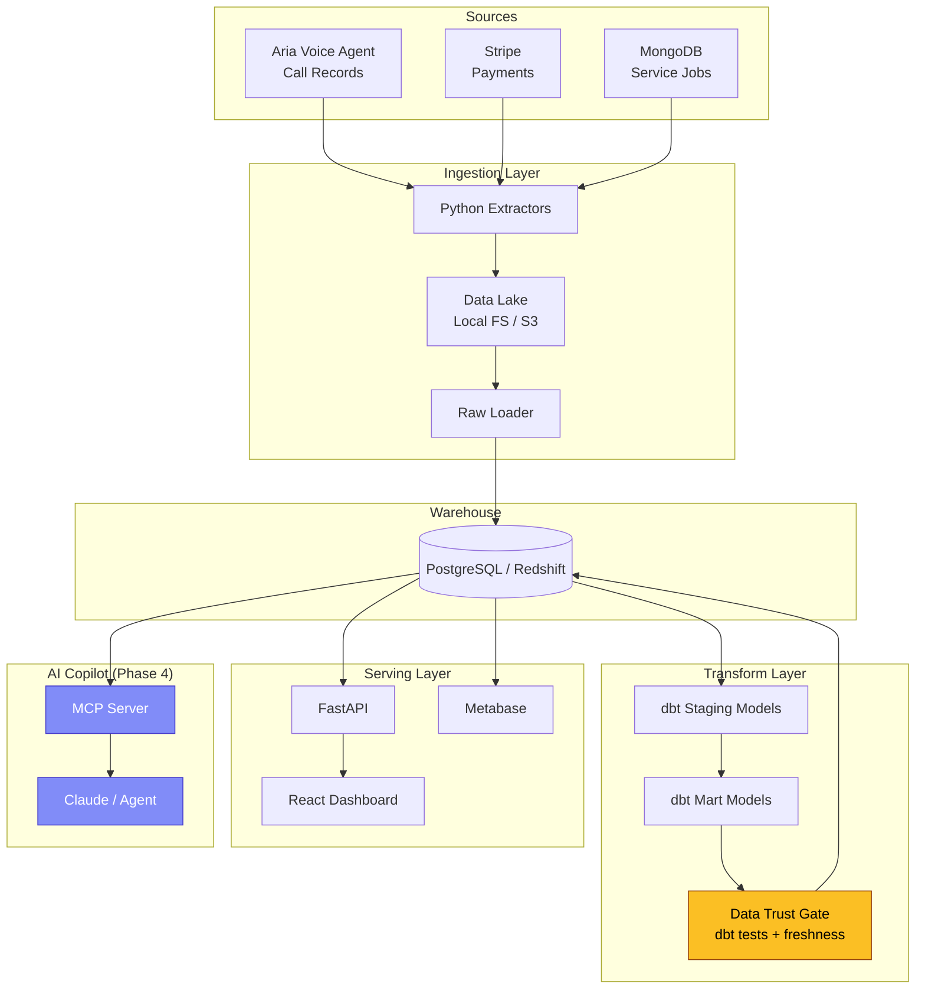
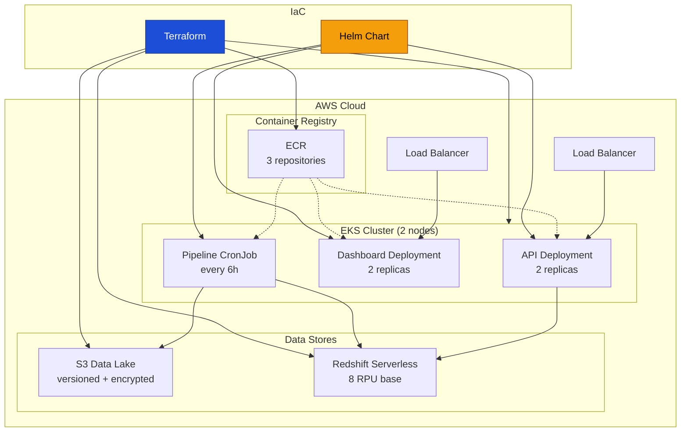
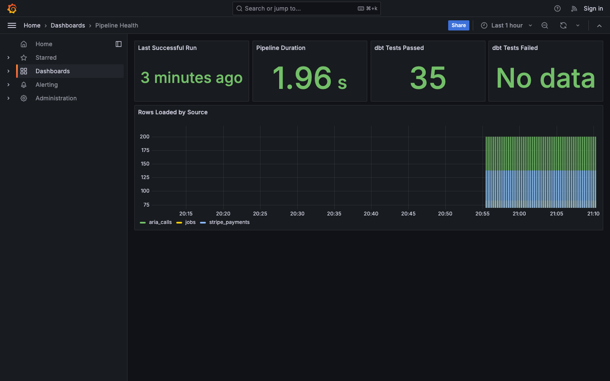
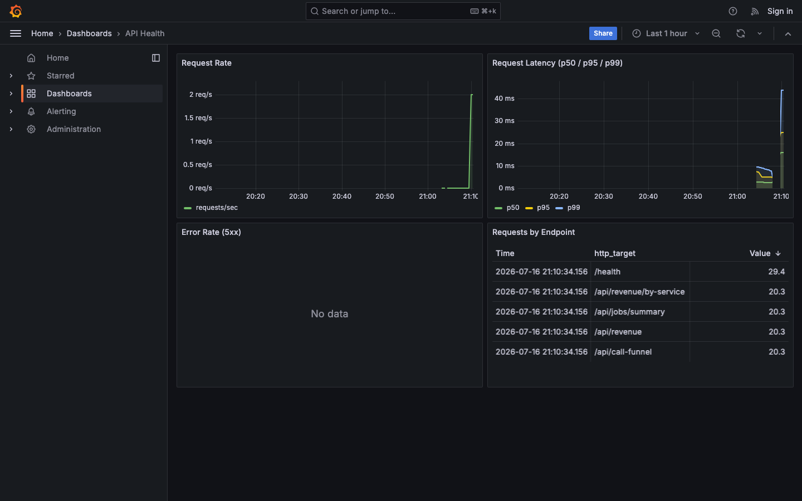
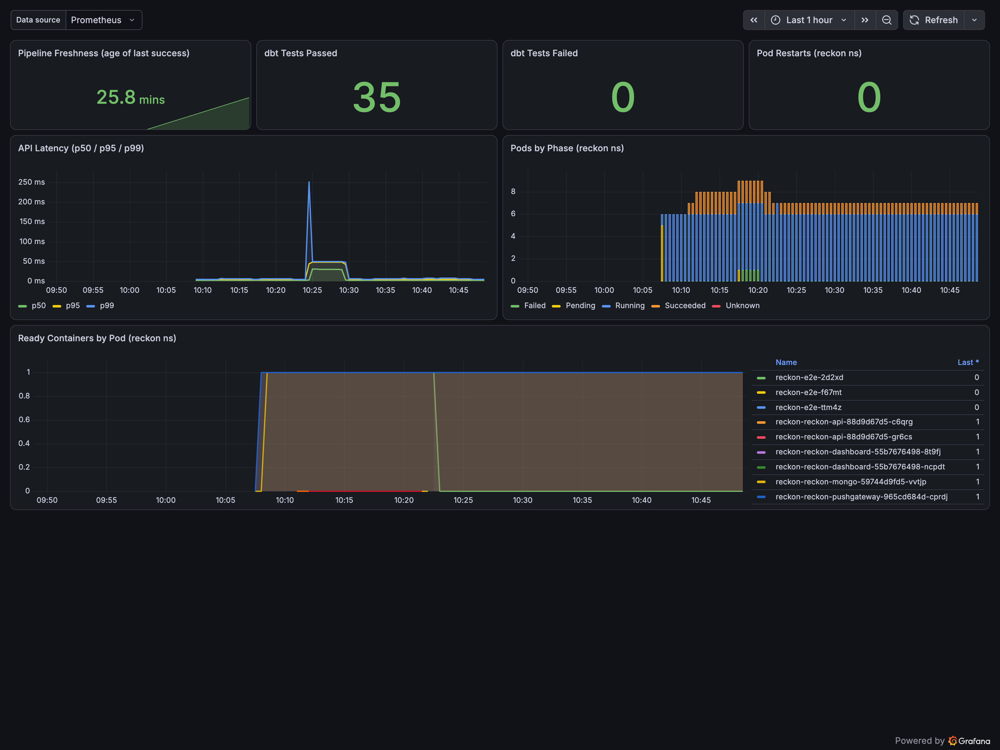

# Reckon

**A business-intelligence platform with an AI copilot.**

Reckon ingests a business's scattered operational data, pipelines it into a warehouse, surfaces dashboards, and lets a non-technical owner ask questions in plain English. Data flows in from three sources: **Aria** (AI voice agent call records), **Stripe** (payment transactions), and **MongoDB** (service job records). Metabase provides self-serve BI alongside the custom React dashboard.

---

## Dashboard

<p align="center">
  
</p>
<p align="center">
  
</p>

---

## Architecture



### AWS Cloud Architecture (Phase 2)



## Project Structure

```
Reckon/
├── ingest/                  # Python extractors and data-lake writers
│   ├── extractors/          # Per-source extractors (Aria, Stripe, MongoDB)
│   ├── tests/               # Extractor unit tests
│   ├── config.py            # Config loader (env-var driven)
│   ├── lake.py              # Data-lake abstraction (local / S3)
│   ├── loader.py            # Raw-to-warehouse loader
│   └── pipeline.py          # Pipeline entrypoint
├── transform/               # dbt project
│   ├── models/staging/      # Cleaned, typed views
│   ├── models/marts/        # Business-logic tables
│   ├── dbt_project.yml
│   └── profiles.yml         # Config-driven (Postgres / Redshift)
├── warehouse/init/          # DDL scripts for schema init
├── api/                     # FastAPI serving layer
├── dashboard/               # React + Recharts dashboard
│   └── src/components/      # KPI cards, funnel chart, revenue chart
├── mongo/init/              # MongoDB seed data and init script
├── metabase/                # Metabase setup script
├── copilot/                 # MCP copilot server (AI Q&A over warehouse)
│   ├── tests/               # Trust gate, security, and tool correctness tests
├── infra/
│   ├── terraform/           # AWS infrastructure (VPC, EKS, Redshift, S3, ECR, IAM)
│   ├── helm/reckon/         # Helm chart (API, dashboard, pipeline CronJob)
│   └── docker/              # Dockerfiles
├── scripts/                 # Pipeline and ECR push scripts
├── observability/           # Prometheus, Grafana, Loki (Phase 3)
├── .github/workflows/       # CI/CD (GitHub Actions)
├── docker-compose.yml       # One-command local dev
├── Makefile                 # make up / make down / make deploy
└── .env.example             # Environment template
```

## Quick Start

### Prerequisites
- Docker and Docker Compose

### Run It

```bash
# 1. Clone and configure
git clone https://github.com/andrewbolaji/reckon.git && cd reckon
cp .env.example .env

# 2. Start everything
docker-compose up --build

# 3. What happens:
#    - PostgreSQL warehouse starts
#    - Pipeline runs: extracts sample data, loads to warehouse, runs dbt
#    - API starts on http://localhost:8000
#    - Dashboard starts on http://localhost:5173
```

### Verify

| Service     | URL                          | What to check                     |
|-------------|------------------------------|-----------------------------------|
| API health  | http://localhost:8000/health  | `{"status": "ok"}`               |
| Call funnel | http://localhost:8000/api/call-funnel | Daily funnel data with job counts |
| Revenue     | http://localhost:8000/api/revenue     | Daily revenue data        |
| Jobs        | http://localhost:8000/api/jobs/summary | Completion rate, value    |
| Dashboard   | http://localhost:5173         | Interactive charts and KPIs      |
| Metabase    | http://localhost:3001         | Self-serve BI (run `bash metabase/setup.sh` first) |
| Grafana     | http://localhost:3002         | Pipeline and API dashboards (`make observability` only) |

### Run Tests Locally

```bash
# Extractor unit tests
pip install psycopg2-binary boto3 pytest
pytest ingest/tests/ -v

# dbt tests (requires warehouse running)
cd transform
pip install dbt-core dbt-postgres
dbt deps --profiles-dir .
dbt test --profiles-dir .
```

## Deploy to AWS

> **COST WARNING**: EKS (~$0.10/hr for the control plane + ~$0.08/hr for 2x t3.medium nodes),
> Redshift Serverless (~$0.36/RPU-hr, 8 RPU minimum when active), NAT Gateway (~$0.045/hr),
> and Load Balancers (~$0.025/hr each) all cost money while running. **Stand it up, verify,
> screenshot, tear it down.** A full stack running for 1 hour costs roughly $3-5. `make down`
> destroys everything completely.

### Prerequisites
- AWS CLI configured (`aws configure`)
- Terraform >= 1.5
- Docker
- kubectl
- Helm 3

### Deploy

```bash
# 1. Configure Terraform variables
cp infra/terraform/terraform.tfvars.example infra/terraform/terraform.tfvars
# Edit terraform.tfvars: set redshift_admin_password

# 2. Set Redshift credentials for Helm
export REDSHIFT_USER=reckon_admin
export REDSHIFT_PASSWORD=your_password_here

# 3. Deploy everything (Terraform + ECR push + Helm install)
make up

# 4. Trigger the first pipeline run
make pipeline-run

# 5. Check status
make status
```

The `make up` command:
1. Runs `terraform init` and `terraform apply` (VPC, EKS, Redshift, S3, ECR, IAM)
2. Builds all 3 Docker images and pushes to ECR
3. Updates kubeconfig for the new EKS cluster
4. Helm-installs the chart with all Terraform outputs wired in
5. Prints the LoadBalancer URLs for API and dashboard

### Access

| Service   | URL |
|-----------|-----|
| Dashboard | `kubectl get svc -n reckon reckon-reckon-dashboard -o jsonpath='{.status.loadBalancer.ingress[0].hostname}'` |
| API       | `kubectl get svc -n reckon reckon-reckon-api -o jsonpath='{.status.loadBalancer.ingress[0].hostname}'` |

### Redeploy (code changes only)

```bash
make deploy   # Rebuilds images, pushes to ECR, rolls out new pods
```

### Teardown

```bash
make down     # Helm uninstall + terraform destroy. Zero resources remain.
```

This deletes the EKS cluster, Redshift namespace, S3 bucket (force-emptied), ECR repos (force-deleted),
VPC, NAT gateway, load balancers, and all IAM roles. Nothing is left running or billing.

### Local Dev (unchanged from Phase 1)

```bash
docker compose up --build   # or: make local
```

---

## AI Copilot

The copilot lets a non-technical owner ask plain-English questions and get answers grounded in the warehouse marts. Every answer is auditable: the tool called, the SQL query, and the rows returned are shown alongside the response.

### Quick Start

```bash
# Install copilot deps
pip install -r copilot/requirements.txt

# Set your API key
export ANTHROPIC_API_KEY=sk-ant-...

# With docker compose running:
python -m copilot.cli
```

### Example Sessions

The transcripts below are real, captured by running `python -m copilot.cli` against
the live warehouse. Every number is verified against a direct SQL query.

**What's my booking rate?**

```
============================================================
Question: What's my booking rate?
============================================================

  Tool: call_funnel
  Input: {}
  SQL: SELECT
           sum(total_calls) AS total_calls,
           sum(booked) AS booked,
           sum(qualified) AS qualified,
           sum(escalated) AS escalated,
           sum(missed) AS missed,
           sum(resolved) AS resolved,
           round(100.0 * sum(booked) / nullif(sum(total_calls), 0), 1) AS booking_rate_pct,
           round(100.0 * sum(escalated) / nullif(sum(total_calls), 0), 1) AS escalation_rate_pct,
           round(avg(avg_sentiment), 2) AS avg_sentiment,
           sum(total_jobs) AS total_jobs,
           sum(completed_jobs) AS completed_jobs,
           sum(cancelled_jobs) AS cancelled_jobs
       FROM marts.mart_call_funnel
  Rows: 1

- - - - - - - - - - - - - - - - - - - - - - - - - - - - - -
Answer:
Your overall booking rate is 41.5%. Out of 200 total calls, 83 resulted
in a booking. Average caller sentiment is 0.66 / 1.0.
```

Direct query confirmation: `SELECT sum(total_calls), sum(booked) FROM marts.mart_call_funnel` -> 200 calls, 83 booked, 41.5%.

---

**Which service makes the most money?**

```
============================================================
Question: Which service makes the most money?
============================================================

  Tool: revenue_summary
  Input: {"group_by": "service"}
  SQL: SELECT
           service_description,
           sum(transaction_count) AS transaction_count,
           round(sum(revenue_dollars), 2) AS revenue_dollars,
           round(sum(net_revenue_dollars), 2) AS net_revenue_dollars,
           round(avg(avg_ticket_dollars), 2) AS avg_ticket_dollars,
           sum(refund_count) AS refund_count
       FROM marts.mart_revenue
       GROUP BY service_description
       ORDER BY revenue_dollars DESC
  Rows: 9

- - - - - - - - - - - - - - - - - - - - - - - - - - - - - -
Answer:
Water Heater Replacement is your top earner at $19,534.94 gross ($17,800.91 net)
across 12 transactions. Panel Upgrade has the highest average
ticket at $1,505.77 per job. Emergency Gas Leak ranks second at $19,360.64.
```

Direct query confirmation: `SELECT service_description, sum(revenue_dollars) FROM marts.mart_revenue GROUP BY 1 ORDER BY 2 DESC LIMIT 1` -> Water Heater Replacement, $19,534.94.

---

**How much revenue in the last 30 days?**

```
============================================================
Question: How much revenue in the last 30 days?
============================================================

  Tool: check_freshness
  Input: {}

  Tool: revenue_summary
  Input: {"date_from": "2026-06-16", "date_to": "2026-07-16"}
  SQL: SELECT
           sum(transaction_count) AS transaction_count,
           round(sum(revenue_dollars), 2) AS revenue_dollars,
           round(sum(net_revenue_dollars), 2) AS net_revenue_dollars,
           round(avg(avg_ticket_dollars), 2) AS avg_ticket_dollars,
           sum(refund_count) AS refund_count,
           round(sum(refund_dollars), 2) AS refund_dollars
       FROM marts.mart_revenue
       WHERE payment_date >= %s AND payment_date <= %s
  Rows: 1

- - - - - - - - - - - - - - - - - - - - - - - - - - - - - -
Answer:
For June 16 - July 16, 2026: gross revenue $77,389.44, net revenue
$61,198.05 across 121 transactions (avg ticket $664.76). Refunds totalled
$16,191.39 across 30 events.
```

Direct query confirmation: `SELECT sum(revenue_dollars), sum(net_revenue_dollars), sum(transaction_count) FROM marts.mart_revenue WHERE payment_date >= '2026-06-16'` -> $77,389.44 gross / $61,198.05 net / 121 txns.

### Stale Data Refusal

When the pipeline has not run recently (>48 hours), the copilot refuses to answer rather
than give stale numbers. Reproduced by running
`UPDATE raw.aria_calls SET _loaded_at = now() - interval '50 hours'`:

```
============================================================
Question: How much revenue last week?
============================================================

  Tool: check_freshness
  Input: {}

  Tool: revenue_summary
  Input: {"date_from": "2026-07-06", "date_to": "2026-07-12"}
  Error: Cannot answer: data is stale. aria_calls: stale (50h old,
         threshold is 48h). Please run the pipeline before querying.

- - - - - - - - - - - - - - - - - - - - - - - - - - - - - -
Answer:
Cannot answer: data is stale. aria_calls: stale (50h old, threshold is
48h). Please run the pipeline before querying.
```

After restoring `_loaded_at` to `now()` the same question returns $15,772.50 gross /
$11,891.78 net / 26 transactions (confirmed: direct query matches exactly).

### Out-of-Scope Refusal

When asked something the marts cannot answer, the copilot says so honestly:

```
============================================================
Question: Who is my biggest customer by name?
============================================================

- - - - - - - - - - - - - - - - - - - - - - - - - - - - - -
Answer:
Customer-level data is not available through any of my tools. The mart
tables (mart_revenue, mart_call_funnel, mart_jobs) aggregate by service
category, payment method, and date. They do not contain customer names
or IDs. To find your biggest customer by name, query your CRM or Stripe
customer records directly.
```

### Claude Desktop Integration

Add this to your `claude_desktop_config.json`:

```json
{
  "mcpServers": {
    "reckon": {
      "command": "python",
      "args": ["-m", "copilot.server"],
      "cwd": "/path/to/Reckon",
      "env": {
        "POSTGRES_HOST": "localhost",
        "POSTGRES_PORT": "5432",
        "POSTGRES_DB": "reckon",
        "POSTGRES_USER": "reckon",
        "POSTGRES_PASSWORD": "reckon_dev",
        "COPILOT_DB_USER": "reckon_reader",
        "COPILOT_DB_PASSWORD": "reckon_reader_dev"
      }
    }
  }
}
```

### Security Model

Safety lives in the tools and the database role, not in the prompt:

1. **DB role enforcement** (load-bearing): the `reckon_reader` Postgres role has `SELECT` on the `marts` schema only. No access to `raw`, `staging`, or system catalogs. Even if the SQL validator misses something, the database blocks it.
2. **SQL validator** (defense in depth): rejects DDL, DML, multi-statement input, and references to non-allowlisted tables before the query reaches the database.
3. **Read-only session**: the connection is set to `READ ONLY` mode, so writes fail even if the role somehow allowed them.
4. **Row cap and timeout**: maximum 100 rows per query, 5-second timeout.
5. **Error sanitization**: database errors return a generic message to the user; raw error details (table names, column names, query text) go only to the server-side audit log.
6. **Parameterized queries**: all tool-generated SQL uses `%s` placeholders. User-supplied filter values never touch the query string.
7. **Audit log**: every tool call, query, and refusal is logged as structured JSON to stderr.

### Threat Model

#### Assets

- **Warehouse marts**: aggregated business metrics (revenue, calls, jobs). No PII in marts; raw schema contains customer emails but is inaccessible to the copilot role.
- **Database credentials**: the `reckon_reader` role password and the admin connection credentials.
- **The `reckon_reader` role itself**: its privilege boundary is the primary security control.

#### Threats and mitigations

| Threat | Mitigation |
|--------|------------|
| **SQL injection** (user crafts input that alters query logic) | Parameterized queries (`%s` placeholders) for all filter values; SQL validator rejects DDL/DML/multi-statement; DB role blocks access to non-marts tables even if validation is bypassed. |
| **Direct prompt injection** (user asks the LLM to ignore instructions) | Safety is in the tools and DB role, not the prompt. The LLM can only call the defined tools, each of which enforces its own guardrails. The worst case is a bad answer, not a data breach. |
| **Indirect / data-borne prompt injection** (malicious content in warehouse data tricks the LLM) | See residual risks below. |
| **Data exfiltration** (extracting raw/staging data through the copilot) | `reckon_reader` has no grants on `raw` or `staging` schemas. The SQL validator rejects references to non-allowlisted tables. Row cap limits bulk extraction from marts. |
| **Privilege escalation** (gaining write access or admin privileges) | Read-only session mode, read-only DB role, no GRANT/ALTER/CREATE permissions. Tested with 5 role-enforcement tests. |
| **Stale-data trust** (answering with outdated numbers as if current) | Freshness trust gate checks `_loaded_at` timestamps: >48h refuses, 24-48h adds caveat. Gate runs before every data tool. |
| **Information disclosure** (DB error messages leak schema internals) | Error sanitization returns a generic message; raw details go only to the server-side audit log. |

#### Residual risks (stated honestly)

- **Indirect prompt injection**: if an attacker can write data that ends up in a mart (e.g. a malicious service description), the LLM might follow embedded instructions. No runtime content filter is in place. Mitigation depends on input validation upstream of the warehouse.
- **No request rate limiting**: a user (or automated client) can call tools as fast as the MCP transport allows. No per-user or per-minute throttle exists. In production, add rate limiting at the transport or API gateway layer.
- **Single-tenant demo**: there is one DB role, one set of credentials, and no multi-tenant row-level security. All users see all marts data. Production would need tenant isolation.
- **Credential storage**: DB passwords are passed via environment variables and `.env` files, not a secrets manager. Acceptable for local dev; production should use AWS Secrets Manager or equivalent.

### Run Copilot Tests

```bash
# All tests (requires docker compose up)
pytest copilot/tests/ -v

# Unit tests only (no DB required)
pytest copilot/tests/test_trust_gate.py::TestSqlValidation \
       copilot/tests/test_trust_gate.py::TestRowCap \
       copilot/tests/test_tools.py::TestDescribeSchema \
       copilot/tests/test_security.py::TestSqlInjection -v
```

---

## Data Pipeline

1. **Extract.** Python extractors pull data from three sources: Aria call records, Stripe payments, and MongoDB service jobs.
2. **Land.** Raw JSON written to data lake (local filesystem, swappable to S3). Lake writes are idempotent (prior extracts cleared before new writes).
3. **Load.** Raw data loaded into `raw` schema in the warehouse.
4. **Transform.** dbt staging models clean and type the data; mart models aggregate into business metrics (call funnel, revenue, job completion).
5. **Trust Gate.** dbt tests validate uniqueness, not-null, accepted values; source freshness checks ensure data is current across all three sources.
6. **Serve.** FastAPI reads from marts; React dashboard and Metabase visualize the data.

## Data Trust Gate

Every model has dbt tests that enforce:
- **Uniqueness**: no duplicate `call_id` or `payment_id`
- **Not-null**: critical fields are always present
- **Accepted values**: `urgency`, `outcome`, and `status` are constrained to known values
- **Source freshness**: data older than 24h triggers a warning; older than 48h fails the pipeline

The pipeline uses `dbt build`, which runs tests inline. A failing test stops downstream models from materializing.

## Observability

All observability services run behind a Docker Compose profile. The core stack (`docker compose up`) is unchanged. To enable observability:

```bash
make observability    # sets OTEL_ENABLED=true and starts the observability profile
```

This starts Prometheus, Pushgateway, Grafana, Loki, and Promtail alongside the existing services.

| Service     | URL                          | What it shows                          |
|-------------|------------------------------|----------------------------------------|
| Grafana     | http://localhost:3002         | Pipeline Health and API Health dashboards |
| Prometheus  | http://localhost:9090         | Metrics and alert rules                |
| Loki (via Grafana) | Explore tab in Grafana | Centralized container logs             |

### Grafana Dashboards

<p align="center">
  
</p>

**Pipeline Health**: last successful run, pipeline duration, dbt test pass/fail counts, rows loaded by source.

<p align="center">
  
</p>

**API Health**: request rate, latency percentiles (p50/p95/p99), 5xx error rate, requests by endpoint.

### Alert Rules

Two Prometheus alert rules in `observability/prometheus/alerts.yml`:

1. **PipelineFreshnessBreach**: fires when the pipeline has not run successfully in over 48 hours (matches the copilot's trust gate threshold).
2. **PipelineDbtTestFailure**: fires immediately when any dbt test fails or errors.

### Cluster Monitoring (EKS)

The same observability, but on the cluster itself. `make monitoring` installs
[kube-prometheus-stack](https://github.com/prometheus-community/helm-charts) from a
committed values file (`infra/helm/monitoring/values.yaml`) into the `monitoring`
namespace — Prometheus, Grafana, Alertmanager, node-exporter, and kube-state-metrics.
It is folded into `make up`, so a full deploy comes up **with** monitoring, and
`make down` removes it (releasing its LoadBalancer) before Terraform destroy.

```bash
# Email alerts need SMTP creds (never committed) — inject at install time:
export SMTP_USER=you@gmail.com SMTP_PASSWORD=<gmail-app-password> ALERT_EMAIL=you@gmail.com
make monitoring          # or just `make up` — monitoring is included
```

Dashboards provision as code (labelled ConfigMaps loaded by the Grafana sidecar) with
**zero clicks**. Alongside the ported Pipeline Health and API Health dashboards, a new
**Reckon Health** dashboard shows pipeline freshness, dbt test pass/fail, API latency,
and pod health for the `reckon` namespace.

<p align="center">
  
</p>

Both alert rules (`PipelineFreshnessBreach`, `PipelineDbtTestFailure`) run in the
cluster Prometheus, and Alertmanager is wired to a real email receiver so the freshness
breach actually notifies.

### Splunk Forwarding

To forward logs to Splunk via HEC, set `SPLUNK_HEC_URL` and `SPLUNK_HEC_TOKEN` in your `.env` and uncomment the Splunk client block in `observability/promtail/promtail-config.yml`. See the HANDBOOK for details.

## Roadmap

### Phase 1: Foundation
- [x] Monorepo scaffold
- [x] Two Python extractors with sample data
- [x] Data-lake abstraction (local / S3)
- [x] dbt staging + marts with tests and freshness
- [x] FastAPI serving layer
- [x] React dashboard (call funnel + revenue)
- [x] GitHub Actions CI
- [x] Docker Compose for local dev

### Phase 2: Cloud and Kubernetes
- [x] Terraform IaC: VPC, EKS cluster, Redshift Serverless, S3 data lake, ECR, IAM
- [x] Helm chart: API and dashboard Deployments, pipeline CronJob, K8s Secrets
- [x] ECR build-and-push scripts for all 3 images
- [x] Config-driven cloud swap (env vars + K8s Secrets, zero app code changes)
- [x] Makefile lifecycle: `make up` (full deploy), `make down` (full teardown), `make deploy` (redeploy)
- [x] dbt multi-target profiles (dev=Postgres, prod=Redshift)
- [x] Security groups scoped: EKS nodes <-> Redshift only

### Phase 3: Observability and BI
- [x] MongoDB as a third data source (service jobs)
- [x] Metabase for self-serve BI (auto-provisioned warehouse connection)
- [x] Idempotent lake writes and deterministic seed data
- [x] OpenTelemetry instrumentation (API RED metrics, pipeline counters), config-gated via `OTEL_ENABLED`
- [x] Prometheus scraping API and Pushgateway; alert rules for freshness breach and dbt test failure
- [x] Grafana dashboards auto-provisioned: Pipeline Health and API Health
- [x] Loki for centralized logs via Promtail, with Splunk HEC forwarding documented
- [x] All observability behind `profiles: [observability]`. `make observability` to enable, zero impact on core stack

### Phase 4: AI Copilot
- [x] MCP server (6 tools: revenue, call funnel, jobs, freshness, schema, guarded SQL)
- [x] Read-only SQL guardrails (query validation, row cap, statement timeout, allowlisted tables)
- [x] Read-only DB role (`reckon_reader`): SELECT on marts only, no raw or staging access
- [x] Trust-gate enforcement: stale data (>48h) produces a refusal, not a guess; warn (24-48h) adds a caveat
- [x] Freshness gate based on pipeline load time (`_loaded_at`), not event timestamps
- [x] CLI REPL demo: grounded answers with the query and rows shown alongside every answer
- [x] Claude Desktop integration documented
- [x] 60 tests: security (injection, privilege escalation, error sanitization), trust gate (freshness, SQL validation), tool correctness
- [ ] Conversation memory and follow-up queries

### Phase 5: Cluster Monitoring
- [x] kube-prometheus-stack via Helm on EKS, from a committed values file (`infra/helm/monitoring/values.yaml`) — never click-configured
- [x] Wired into the Makefile: `make monitoring` (also folded into `make up`); `make down` tears it down before Terraform destroy
- [x] All three Grafana dashboards provisioned as code (labelled ConfigMaps, sidecar auto-load): Pipeline Health, API Health, and a new **Reckon Health** (pipeline freshness, dbt test pass/fail, API latency, pod health for the `reckon` namespace)
- [x] App metrics scraped in-cluster: API `/metrics` via a ServiceMonitor; pipeline metrics via an in-cluster Pushgateway + ServiceMonitor
- [x] Both Prometheus alert rules ported into the cluster stack (`PipelineFreshnessBreach`, `PipelineDbtTestFailure`) as a PrometheusRule
- [x] Alertmanager with a real email receiver — the freshness breach actually notifies (SMTP creds injected at install, never committed)

## Tech Stack

| Layer         | Technology                              |
|---------------|-----------------------------------------|
| Ingestion     | Python, custom extractors, pymongo      |
| Data Lake     | Local FS / AWS S3                       |
| Warehouse     | PostgreSQL (dev) / Redshift (prod)      |
| Transform     | dbt (staging + marts + tests)           |
| API           | FastAPI, psycopg2                       |
| Dashboard     | React, Recharts, Vite                   |
| Self-serve BI | Metabase                                |
| Document DB   | MongoDB 7                               |
| Infra (local) | Docker, Docker Compose                  |
| Infra (cloud) | Terraform, AWS EKS, Helm, Kubernetes    |
| Cloud storage | AWS S3 (data lake), Redshift Serverless |
| Registry      | AWS ECR                                 |
| Networking    | VPC, NAT Gateway, Security Groups, IAM  |
| Observability | OpenTelemetry, Prometheus, Grafana, Loki, Promtail |
| CI/CD         | GitHub Actions, Makefile                |
| AI Copilot    | MCP, Claude, Anthropic SDK               |

---

